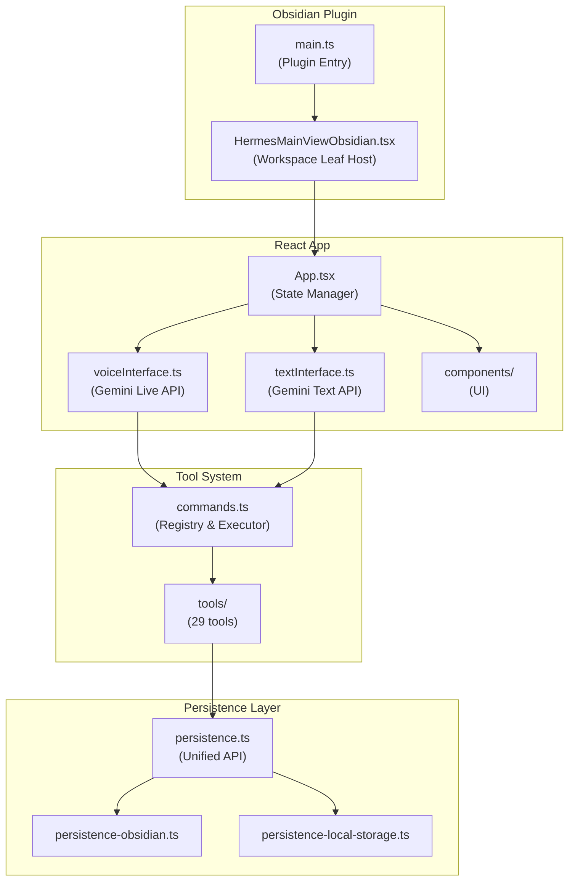

# Hermes Voice Assistant - Agent Guide

## Architecture Overview



## Key Features

- **Voice Interface**: Real-time audio via `@google/genai` Live API (Gemini 2.5 Flash)
- **Text Interface**: Standard chat via Gemini 2.0 Flash
- **Vault Operations**: Full CRUD on Obsidian vault files
- **Tool Calling**: 29 tools for file ops, search, web, images, Obsidian commands
- **Conversation Archiving**: Auto-archive on `topic_switch` or `end_conversation`
- **History Persistence**: LLM-generated titles/tags/summaries saved to vault + plugin data

## Persistence Pipeline

On `topic_switch` or session end:

1. **FILTER** - Remove verbose tools (context, file_tree, read_file)
2. **TRANSFORM** - Convert to markdown
3. **LLM CALL** - Get title, tags, filename, summary, shouldSave
4. **CHECK** - Skip if shouldSave=false or already archived (topicId dedup)
5. **FILENAME** - `YYYY-MM-DD-II-keywords.md`
6. **FRONTMATTER** - YAML with metadata
7. **VAULT SAVE** - Write `.md` to `chatHistoryFolder`
8. **JSON SAVE** - Add to `archivedConversations` array in plugin data

## Caveats & Rules

### Persistence API

- **ALWAYS** use `persistence/persistence.ts` for settings/data access
- **NEVER** call `obsidianPlugin.saveData()` directly - use `persistData()` for atomic writes
- `persistData()` uses mutex lock to prevent race conditions
- Settings are cached; use `reloadAppSettings()` to force refresh

### Vault Operations

- Use `services/vaultOperations.ts` for file I/O (`createFile`, `readFile`, etc.)
- All paths are relative to vault root
- Check file existence before operations when needed

### Tool Development

- Each tool in `tools/` exports: `declaration` (schema) + `execute` (handler)
- Tools receive `callbacks: ToolCallbacks` for logging/system messages
- Return structured data; errors should throw or return error objects

### State Management

- `transcripts` state lives in `App.tsx`
- `topicId` groups messages; changes on `topic_switch`
- Use `transcriptsRef.current` in callbacks to avoid stale closures
- Voice session cleanup happens in `voiceInterface.stop()`

### API Keys

- Stored in plugin settings via persistence layer
- `manualApiKey` = Gemini API key
- `serperApiKey` = Web search API key (optional)

### Environment Detection

- `isObsidian()` from `utils/environment.ts` detects runtime
- Standalone mode uses localStorage; Obsidian mode uses plugin data

### CSS Colors & Styling

**⚠️ CRITICAL: Single Source of Truth for Colors**

- **ALL color variables** are defined in `styles-input.css` (lines 78-118)
- **NEVER** hardcode colors in components - always use CSS variables
- **NEVER** edit `styles.css` (generated/minified) - changes will be lost
- **NEVER** edit `main-colors-cleaned.css` - layout only, no colors

**Color Variable Pattern:**
```css
/* In styles-input.css - ONLY EDIT HERE */
--hermes-bg-primary: var(--background-primary, #1e1e1e);
--hermes-bg-secondary: var(--background-secondary, #252525);
--hermes-text-normal: var(--text-normal, #e0e0e0);
--hermes-brand: #6366f1;
```

**Usage in Components:**
```tsx
// GOOD - Use CSS variables
className="hermes-bg-secondary hermes-text-normal"

// BAD - Never hardcode colors
className="bg-[#252525] text-[#e0e0e0]"
```

**Build Process:**
1. Edit `styles-input.css` → Run `pnpm run build-css` → Updates `styles.css`
2. Variables automatically fallback to Obsidian theme colors when available
3. Standalone mode uses the fallback hex values

**Utility Classes:**
- Use `hermes-bg-*` for backgrounds
- Use `hermes-text-*` for text colors  
- Use `hermes-hover:*` for hover states
- System message colors are hardcoded for reliability (error, warning, success, info)

**Color Variable Reference:**
```css
/* Backgrounds */
--hermes-bg-primary: var(--background-primary, #1e1e1e)
--hermes-bg-secondary: var(--background-secondary, #252525) 
--hermes-bg-secondary-alt: var(--background-secondary-alt, #2a2a2a)
--hermes-bg-tertiary: var(--background-tertiary, #303030)

/* Text */
--hermes-text-normal: var(--text-normal, #e0e0e0)
--hermes-text-muted: var(--text-muted, #999999)
--hermes-text-faint: var(--text-faint, #666666)
--hermes-text-accent: var(--text-accent, #7c3aed)

/* Brand & Interactive */
--hermes-brand: #6366f1
--hermes-interactive: var(--interactive-normal, #484848)
--hermes-interactive-hover: var(--interactive-hover, #585858)
```

**⚠️ ENFORCEMENT:**
- Any PR with hardcoded colors (like `bg-[#252525]`) will be rejected
- Always use the `hermes-*` utility classes or CSS variables
- This ensures consistent theming across Obsidian and standalone modes
