# History Persistence Pipeline

This document describes the conversation history persistence lifecycle in Hermes.

## Architecture

**Plugin Data** (two separate keys):
- **`current_conversation`** - Live working memory, unfiltered transcripts (never cleared by archive)
- **`history`** - Array of archived conversations with LLM-generated metadata

**Persistence Targets** (when archiving):
1. **Vault Markdown** - `.md` file in configurable `chat-history/` folder
2. **Plugin JSON** - Appended to `history` array with metadata

## Plugin Data Structure

```typescript
{
  current_conversation: TranscriptionEntry[],  // Live, unfiltered (NOT cleared on archive)
  history: ArchivedConversation[]              // Archived with LLM metadata
}

interface TranscriptionEntry {
  id: string;
  role: 'user' | 'model' | 'system';
  text: string;
  isComplete: boolean;
  toolData?: ToolData;
  timestamp: number;
  topicId?: string;  // Groups messages by conversation topic; changes on topic_switch
}

interface ArchivedConversation {
  key: string;
  topicId: string;                  // Unique topic identifier for deduplication
  title: string;                    // From LLM
  tags: string[];                   // From LLM
  summary: string;                  // From LLM
  suggestedFilename: string;        // From LLM
  archivedAt: number;
  conversation: TranscriptionEntry[]; // ← **FILTERED-HISTORY**
}
```

## Topic ID System

**Purpose**: Prevents duplicate archives by tracking conversation segments.

- **Generated on**: App initialization, and after each `topic_switch`
- **Format**: `topic-{timestamp}-{random6chars}` (e.g., `topic-1706456789123-a1b2c3`)
- **Stored in**: Each `TranscriptionEntry.topicId` and `ArchivedConversation.topicId`
- **YAML frontmatter**: Persisted as `topic_id` field

**Flow**:
1. App starts → generates initial `topicId`
2. All new messages get current `topicId`
3. `topic_switch` called → archive OLD topic, generate NEW `topicId`
4. Archive checks if `topicId` already exists → skips if duplicate

## Pipeline Flow (Sequential)

```mermaid
flowchart TD
    %% Trigger
    TRIGGER["🔴 TRIGGER<br/>voiceInterface.stop / end_conversation / topic_switch"]
    
    %% Step 0
    TRIGGER --> STEP0{"**STEP 0: DEDUP CHECK**<br/>topicId already archived?"}
    STEP0 -->|Yes| SKIP_DEDUP["⚠️ SKIP<br/>'Topic already archived'"]
    STEP0 -->|No| STEP1
    
    %% Step 1
    STEP1["**STEP 1: FILTER**<br/>filterTranscriptsForArchive(transcripts)"]
    STEP1 --> FILTERED["📦 **FILTERED-HISTORY**<br/>(TranscriptionEntry[])"]
    
    %% Step 2
    FILTERED --> STEP2["**STEP 2: TO MARKDOWN**<br/>convertToMarkdown(FILTERED-HISTORY)"]
    STEP2 --> MARKDOWN["📄 **MARKDOWN-CONTENT**<br/>(string)"]
    
    %% Step 3
    MARKDOWN --> STEP3["**STEP 3: LLM CALL**<br/>textInterface.generateSummary(prompt)"]
    STEP3 --> LLM_DATA["📋 **LLM-HEADER-DATA**<br/>{ title, tags, suggestedFilename,<br/>summary, shouldSave }"]
    
    %% Step 4
    LLM_DATA --> STEP4{"**STEP 4: CHECK**<br/>shouldSave == true?"}
    STEP4 -->|No| SKIP["⚠️ console.warn<br/>'[HISTORY] SKIP: Nothing to export'<br/>return { skipped: true }"]
    STEP4 -->|Yes| STEP5
    
    %% Step 5
    STEP5["**STEP 5: FILENAME**<br/>getNextArchiveIndex() → YYYY-MM-DD-II"]
    STEP5 --> FILENAME["📁 **FILENAME**<br/>chat-history/YYYY-MM-DD-II-keywords.md"]
    
    %% Step 6
    FILENAME --> STEP6["**STEP 6: FRONTMATTER**<br/>toYaml(LLM-HEADER-DATA + date/duration)"]
    STEP6 --> FRONTMATTER["📝 **YAML-FRONTMATTER**<br/>(string)"]
    
    %% Step 7
    FRONTMATTER --> STEP7["**STEP 7: SAVE VAULT**<br/>createFile(FILENAME, YAML-FRONTMATTER + MARKDOWN-CONTENT)"]
    STEP7 --> VAULT_DONE["✅ Vault file saved"]
    
    %% Step 8
    VAULT_DONE --> STEP8["**STEP 8: SAVE PLUGIN**<br/>addArchivedConversation({<br/>  ...LLM-HEADER-DATA,<br/>  conversation: FILTERED-HISTORY<br/>})"]
    STEP8 --> DONE["✅ Done"]
```



## Data Artifacts

| Artifact | Created In | Used In | Type |
|----------|------------|---------|------|
| **topicId** | STEP 0 | STEP 0, STEP 6, STEP 8 | `string` |
| **FILTERED-HISTORY** | STEP 1 | STEP 2, STEP 8 | `TranscriptionEntry[]` |
| **MARKDOWN-CONTENT** | STEP 2 | STEP 7 | `string` |
| **LLM-HEADER-DATA** | STEP 3 | STEP 4, STEP 6, STEP 8 | `{ title, tags, suggestedFilename, summary, shouldSave }` |
| **FILENAME** | STEP 5 | STEP 7 | `string` |
| **YAML-FRONTMATTER** | STEP 6 | STEP 7 | `string` |

## Sequential Code Flow

```
persistConversationHistory({ transcripts, chatHistoryFolder, textInterface, topicId })
│
├─ STEP 0: DEDUP CHECK
│           └─ topicId = provided || transcripts[0].topicId || generate new
│           └─ if (existingArchives.some(a => a.topicId === topicId))
│               └─ console.warn("[HISTORY] SKIP: Topic already archived")
│               └─ return { skipped: true }
│
├─ STEP 1: FILTERED-HISTORY = filterTranscriptsForArchive(transcripts)
│           └─ removes: context, file_tree, read_file, open_file, welcome-init, "done"
│
├─ STEP 2: MARKDOWN-CONTENT = convertToMarkdown(FILTERED-HISTORY)
│           └─ user text, > model quotes, system blocks
│
├─ STEP 3: LLM-HEADER-DATA = await textInterface.generateSummary(prompt)
│           └─ { title, tags, suggestedFilename, summary, shouldSave }
│
├─ STEP 4: if (!LLM-HEADER-DATA.shouldSave)
│           └─ console.warn("[HISTORY] SKIP: Nothing to export")
│           └─ return { skipped: true }
│
├─ STEP 5: FILENAME = chatHistoryFolder + "/" + getNextArchiveIndex() + "-" + suggestedFilename + ".md"
│           └─ e.g., "chat-history/2025-01-28-03-file-organization.md"
│
├─ STEP 6: YAML-FRONTMATTER = "---\n" + toYaml({ ...LLM-HEADER-DATA, topic_id, date, duration }) + "---\n\n"
│
├─ STEP 7: await createFile(FILENAME, YAML-FRONTMATTER + MARKDOWN-CONTENT)
│
└─ STEP 8: await addArchivedConversation({
             key: "conv-" + timestamp,
             topicId,                      ← for deduplication
             ...LLM-HEADER-DATA,           ← title, tags, summary, suggestedFilename
             archivedAt: Date.now(),
             conversation: FILTERED-HISTORY ← the filtered JS object
           })
```

## Filtering Rules (STEP 1)

| Filter | Reason |
|--------|--------|
| `toolData.name === 'context'` | Context query results are verbose |
| `toolData.name === 'file_tree'` | File tree listings are verbose |
| `toolData.name === 'read_file'` | File content is verbose |
| `toolData.name === 'open_file'` | File content is verbose |
| `id === 'welcome-init'` | System initialization message |
| `text === 'done'` (model) | Empty acknowledgment |

## LLM Prompt (STEP 3)

```
Generate a JSON response with these fields:
- "title": A short, keyword-rich title (2-4 words, max 30 characters)
- "tags": Array of relevant tags for this conversation
- "suggestedFilename": Primary keywords only, lowercase, hyphen-separated (max 40 chars)
- "summary": A bulletpoint list summarizing the conversation
- "shouldSave": true/false - does this conversation have meaningful content worth saving?
  (false for: just greetings, "hi", "hello", "what were we doing", empty exchanges)

Conversation:
user: ...
model: ...

Respond ONLY with valid JSON, no markdown.
```

## Console Logging

```
[HISTORY] SKIP: Topic topic-1706456789-abc123 already archived  ← dedup skip
[HISTORY] STEP 1 - FILTER: 25 entries -> 18 filtered
[HISTORY] STEP 2 - MARKDOWN: length=2450
[HISTORY] STEP 3 - LLM: Requesting metadata...
[HISTORY] STEP 4 - CHECK: shouldSave=true
[HISTORY] STEP 5 - FILENAME: chat-history/2025-01-28-03-file-organization.md
[HISTORY] STEP 6 - YAML: Built frontmatter
[HISTORY] STEP 7 - VAULT: Saved
[HISTORY] STEP 8 - PLUGIN: Saved to history array

// When skipping:
[HISTORY] SKIP: Nothing to export (shouldSave=false)  ← console.warn

// Topic switch:
[HISTORY] EVENT: topic_switch detected - Topic switch triggered
[HISTORY] Topic switch: topic-old-abc123 -> topic-new-xyz789
```

## Key Design Decisions

1. **`current_conversation` NOT cleared** - Archive filters from the live stream, doesn't clear it

2. **Sequential flow** - No parallelism, each step feeds the next

3. **Single LLM call** - One call returns all metadata (title, tags, filename, summary, shouldSave)

4. **LLM decides save** - `shouldSave` field determines if we proceed past STEP 4

5. **WARN on skip** - `console.warn` when nothing to export (not an error)

6. **Metadata in plugin JSON** - `history` array stores LLM metadata for search/display

7. **Pure JS dates** - `getNextArchiveIndex()` uses `new Date().toISOString()` for YYYY-MM-DD-II

8. **js-yaml for YAML** - `toYaml()` prevents YAML syntax errors

9. **topicId for deduplication** - Each conversation segment has a unique `topicId`; archive skips if already saved

10. **topic_switch generates new topicId** - Old topic archived, new ID assigned for subsequent messages
