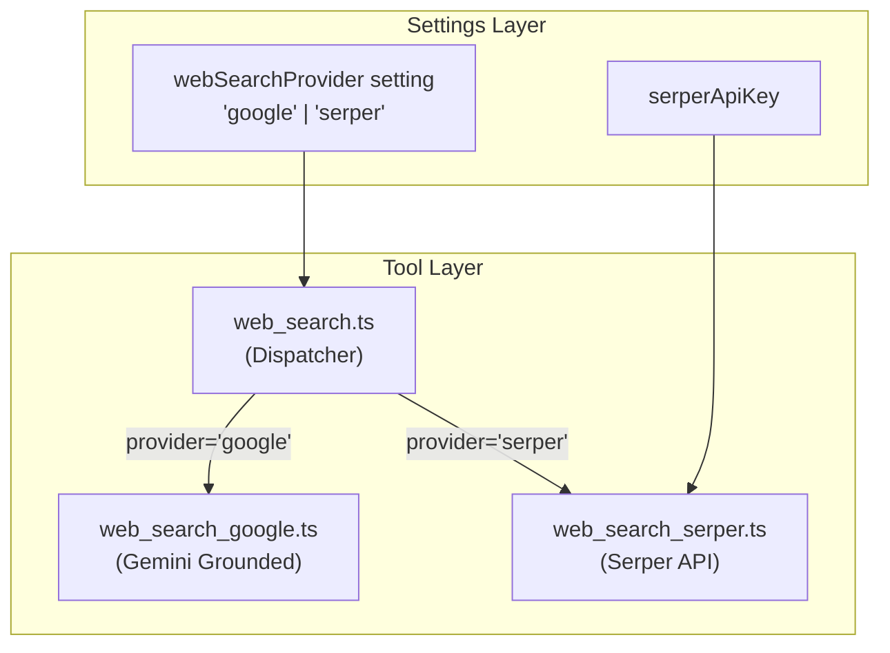

# Web Search Provider Selection Plan

## Problem Statement

The current `internet_search` tool uses **Gemini's grounded search** (`googleSearch` tool), which is slow (3-8 seconds) because it:
1. Runs a full LLM inference with grounding
2. Performs a two-step process: search → synthesize
3. Has no caching

**Goal**: Add Serper as a faster alternative (~200-500ms) while keeping the existing Google search, with a settings dropdown to choose the default provider.

---

## Architecture



---

## Implementation Steps

### Step 1: Add `webSearchProvider` to Types

**File**: `types.ts`

Add to `AppSettings` interface:
```typescript
webSearchProvider?: 'google' | 'serper';
```

**Default behavior**: 
- If `serperApiKey` is set → default to `'serper'`
- Otherwise → default to `'google'`

---

### Step 2: Add Setting to HermesSettings

**File**: `obsidian/HermesSettingsTab.ts`

Add to `HermesSettings` interface:
```typescript
webSearchProvider: 'google' | 'serper';
```

Add to `DEFAULT_HERMES_SETTINGS`:
```typescript
webSearchProvider: 'google',
```

Add dropdown UI after the Serper API key field:
```typescript
new Setting(containerEl)
  .setName('Default web search provider')
  .setDesc('Choose which search provider to use for internet searches')
  .addDropdown((dropdown) => {
    dropdown.addOption('google', 'Google (Gemini Grounded) - Slower, synthesized');
    dropdown.addOption('serper', 'Serper - Fast, raw results');
    
    // Determine effective default
    const hasSerperKey = !!this.plugin.settings?.serperApiKey;
    const currentValue = this.plugin.settings?.webSearchProvider || 
                         (hasSerperKey ? 'serper' : 'google');
    
    dropdown.setValue(currentValue)
      .onChange(async (value) => {
        if (this.plugin.settings) {
          this.plugin.settings.webSearchProvider = value as 'google' | 'serper';
          await this.plugin.saveSettings();
        }
      });
  });
```

---

### Step 3: Create Serper Search Tool

**File**: `tools/web_search_serper.ts`

```typescript
import { loadAppSettings } from '../persistence/persistence';
import type { ToolCallbacks, GroundingChunk } from '../types';

interface SerperResult {
  title: string;
  link: string;
  snippet: string;
  position?: number;
}

interface SerperResponse {
  organic?: SerperResult[];
  answerBox?: { answer?: string; snippet?: string };
  knowledgeGraph?: { title?: string; description?: string };
}

export const execute = async (
  query: string, 
  callbacks: ToolCallbacks
): Promise<{ text: string; groundingChunks: GroundingChunk[]; searchQuery: string }> => {
  const startTime = performance.now();
  
  const settings = loadAppSettings();
  const apiKey = settings?.serperApiKey?.trim();
  
  if (!apiKey) {
    throw new Error('Serper API key not found. Please set it in plugin settings.');
  }

  callbacks.onSystem(`Internet search (Serper): ${query}`, {
    name: 'internet_search',
    filename: query,
    status: 'pending'
  });

  const response = await fetch('https://google.serper.dev/search', {
    method: 'POST',
    headers: {
      'X-API-KEY': apiKey,
      'Content-Type': 'application/json'
    },
    body: JSON.stringify({ q: query, num: 5 })
  });

  if (!response.ok) {
    throw new Error(`Serper API error: ${response.status} ${response.statusText}`);
  }

  const data: SerperResponse = await response.json();
  
  // Build text summary from results
  const parts: string[] = [];
  
  if (data.answerBox?.answer) {
    parts.push(`Answer: ${data.answerBox.answer}`);
  } else if (data.answerBox?.snippet) {
    parts.push(`Answer: ${data.answerBox.snippet}`);
  }
  
  if (data.knowledgeGraph?.description) {
    parts.push(`${data.knowledgeGraph.title || 'Info'}: ${data.knowledgeGraph.description}`);
  }
  
  if (data.organic?.length) {
    parts.push('Search Results:');
    data.organic.slice(0, 5).forEach((r, i) => {
      parts.push(`${i + 1}. ${r.title}\n   ${r.snippet}\n   ${r.link}`);
    });
  }

  const text = parts.join('\n\n') || 'No results found.';
  
  // Convert to groundingChunks format for UI consistency
  const groundingChunks: GroundingChunk[] = (data.organic || []).map(r => ({
    web: { uri: r.link, title: r.title }
  }));

  const endTime = performance.now();
  const duration = Math.round(endTime - startTime);

  callbacks.onSystem(`Internet search (Serper): ${query}`, {
    name: 'internet_search',
    filename: query,
    status: 'success',
    newContent: text,
    groundingChunks,
    duration,
    responseLength: text.length
  });

  return { text, groundingChunks, searchQuery: query };
};
```

---

### Step 4: Rename Current Tool to Google-Specific

**File**: `tools/web_search_google.ts` (rename from `web_search.ts`)

Keep the existing implementation but export only the `execute` function (no declaration, as the dispatcher will handle that).

---

### Step 5: Create Dispatcher

**File**: `tools/web_search.ts` (new dispatcher)

```typescript
import { Type } from "@google/genai";
import { loadAppSettings } from '../persistence/persistence';
import type { ToolCallbacks, GroundingChunk } from '../types';
import * as googleSearch from './web_search_google';
import * as serperSearch from './web_search_serper';

type ToolArgs = Record<string, unknown>;

const getStringArg = (args: ToolArgs, key: string): string | undefined => {
  const value = args[key];
  return typeof value === 'string' ? value : undefined;
};

export const declaration = {
  name: 'internet_search',
  description: 'Search the internet for real-time information, news, current events, or general knowledge outside the vault.',
  parameters: {
    type: Type.OBJECT,
    properties: {
      query: { type: Type.STRING, description: 'The search query to look up on the web.' }
    },
    required: ['query']
  }
};

export const instruction = `- internet_search: Use this to fetch real-time data or information not contained within the local vault. Always use this tool for questions about current events, celebrities, weather, or general knowledge.`;

export const execute = async (
  args: ToolArgs, 
  callbacks: ToolCallbacks
): Promise<{ text: string; groundingChunks: GroundingChunk[]; searchQuery: string }> => {
  const query = getStringArg(args, 'query');
  if (!query) {
    throw new Error('Missing query');
  }

  const settings = loadAppSettings();
  
  // Determine provider: explicit setting > auto-detect based on API key availability
  let provider = settings?.webSearchProvider;
  if (!provider) {
    provider = settings?.serperApiKey?.trim() ? 'serper' : 'google';
  }
  
  // Fallback: if serper selected but no key, use google
  if (provider === 'serper' && !settings?.serperApiKey?.trim()) {
    provider = 'google';
  }

  if (provider === 'serper') {
    return serperSearch.execute(query, callbacks);
  } else {
    return googleSearch.execute(args, callbacks);
  }
};
```

---

### Step 6: Update Persistence Layer (if needed)

The `AppSettings` interface in `types.ts` is the source of truth. The Obsidian settings (`HermesSettings`) mirrors it. No changes needed to `persistence.ts` itself.

---

## File Changes Summary

| File | Action |
|------|--------|
| `types.ts` | Add `webSearchProvider?: 'google' \| 'serper'` to `AppSettings` |
| `obsidian/HermesSettingsTab.ts` | Add `webSearchProvider` to interface, defaults, and UI dropdown |
| `tools/web_search.ts` | Rename to `web_search_google.ts` |
| `tools/web_search_google.ts` | Keep existing Google implementation |
| `tools/web_search_serper.ts` | **NEW** - Serper API implementation |
| `tools/web_search.ts` | **NEW** - Dispatcher that routes to correct provider |

---

## Testing Checklist

- [ ] With no Serper key: defaults to Google, dropdown shows Google selected
- [ ] With Serper key: defaults to Serper, dropdown shows Serper selected
- [ ] Dropdown change persists and takes effect immediately
- [ ] Serper search returns results with grounding chunks
- [ ] Google search still works as before
- [ ] Error handling: Serper selected but key missing → falls back to Google
- [ ] Performance: Serper should be 5-10x faster than Google

---

## Notes

- **Serper API**: Uses `https://google.serper.dev/search` endpoint
- **Rate limits**: Free tier = 2,500 searches, paid = $50/5,000
- **Response format**: Serper returns structured JSON; we convert to `groundingChunks` for UI consistency
- **No breaking changes**: Existing `internet_search` tool name preserved
